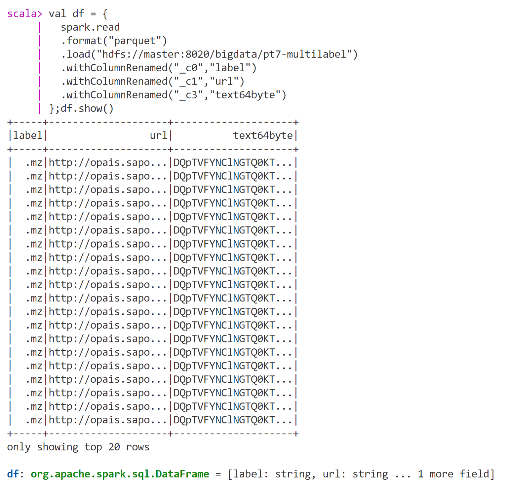
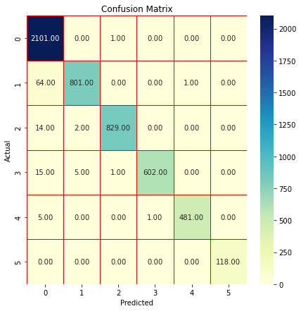
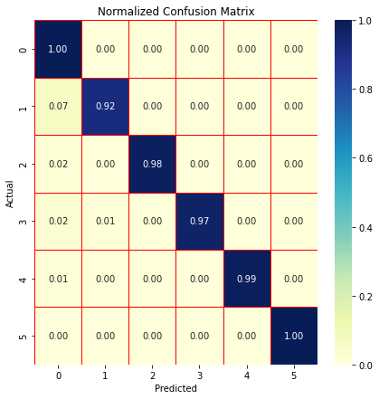
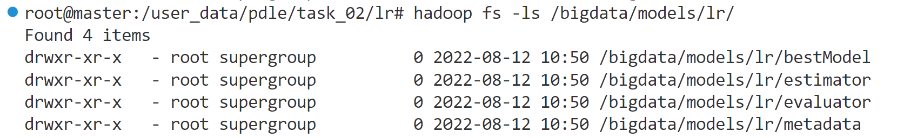

# Large scale data processing project

1. Assemble the cluster
```
unzip resources/cluster.zip
cd resources/cluster/
docker compose up
```

2. In the master command shell, install git:
```
apt install git -y
```
3. Change the folder to /user_data and clone the project:
```
cd /user_data
git clone https://github.com/Dienert/pdle.git
```

4. Restart the cluster
```
/user_data/admin/avertlux.sh
/user_data/admin/fiatlux.sh
```

## Task 01

1. Listing the folders of the HDFS to see if something is there:
```
hadoop fs -ls /
```

2. Since there isn't anything there, let's create the folder we will work and verify it has been created:
```
hadoop fs -mkdir -p /bigdata/
hadoop fs -ls /
```

3. Copying files to HDFS
```
hadoop fs -put /user_data/pdle/data/pt7-raw hdfs://master:8020/bigdata/
```

4. Verifying the files have been copied
```
hadoop fs -ls /bigdata/pt7-raw/
```

5. Processing the first job: labels-pt7-raw.scala
```
spark-shell --master spark://master:7077 -i /user_data/pdle/task_01/labels-pt7-raw.scala
```

6. As the command above has opened the scala shell, we can verify the script has been executed showing the transformed data
```scala
val df = { 
	spark.read
	.format("parquet")
	.load("hdfs://master:8020/bigdata/pt7-multilabel")
	.withColumnRenamed("_c0","label")
	.withColumnRenamed("_c1","url")
	.withColumnRenamed("_c3","text64byte")
};df.show()
```

This is the expected result for this command, as shown in the project specification of Task 01.



* Hints on Spark-shell:
```scala
df.show(false) // showing a dataframe without truncating columns
:reset // Cleaning all spark-shell variables
util.Properties.versionMsg // scala version
sc.version  // spark version
```

7. Still in the scala shell, we can count the number of registers by label
```scala
df.groupBy("label").count.show()
```

8. Or we can count the number of registers by label and order them in a decreasing way
```scala
df.groupBy("label").count.sort(desc("count")).show()
```
Expected result for this command:


9. Processing the second job: etl-pt7.scala
```
spark-shell --master spark://master:7077 -i /user_data/pdle/task_01/etl-pt7.scala
```

If the spark-shell is already active, we can execute the same comand in the following maner:
```
:load /user_data/pdle/task_01/etl-pt7.scala
```

10. To verify the script result, we can execute the following code in spark-shell (scala):
```scala
val df2 = { 
	spark.read
	.format("parquet")
	.load("hdfs://master:8020/bigdata/pt7-hash.parquet")
};df2.show()
```


This is the expected result for this command, as shown in the project specification of Task 01 for the second job.

<br />

## Task 02

1. Install the sbt command in the cluster. This command will generate a jar so each scala script so it can be executed in the Yarn Cluster.
```
sh /user_data/pdle/task_02/install_sbt.sh
```

2. Build the package of the enconding and run the code in the Yarn Cluster
```
cd /user_data/pdle/task_02/encoding
sbt package
sh execute.sh
```

> **Warning**
> If you get the following error message:

```scala
org.apache.spark.sql.AnalysisException: path hdfs://master:8020/bigdata/pt7_indexed_enconded_data already exists.
```

Execute the following command to delete the existing folder in normal shell, not in spark-shell (open a new one or excute ctrl+c to leave spark-shell):
```
hadoop fs -rm -r -f /bigdata/pt7_indexed_enconded_data
```

The command was successful if the following output has been shown:
```
Deleted /bigdata/pt7_indexed_enconded_data
```

Now repeat the item 2 of Task 02.

3. Create a folder to save the trained models
```
hadoop fs -mkdir -p /bigdata/models
```

4. Build the package of the logistic regression training and run the code in the Yarn Cluster
```
cd /user_data/pdle/task_02/lr
sbt package
sh execute.sh
```

## Model and Results

The chosen model was the logistic regression with the following parameters:
```scala
    val lr = new LogisticRegression().
      setMaxIter(10).
      setRegParam(0.3).
      setElasticNetParam(0.8)
```

The gridSearch made a variation between 0.1 and 0.01 for regParam.

The best resulting metrics for the model training were:
* Accuracy = 0.9783773060900615
* Weighted precision: 0.979119849930991
* Weighted recall: 0.9783773060900613
* Weighted F1 score: 0.9782972371066493
* Weighted false positive rate: 0.014321206218802831

The confusion matrices:




And the trained model saved in the HDFS:




## References

https://stackoverflow.com/questions/50384279/why-paramgridbuilder-scala-error-with-countvectorizer

https://spark.apache.org/docs/latest/ml-pipeline.html

https://spark.apache.org/docs/latest/ml-pipeline.html#model-selection-hyperparameter-tuning

https://spark.apache.org/docs/latest/ml-classification-regression.html#logistic-regression

https://spark.apache.org/docs/latest/api/scala/org/apache/spark/ml/evaluation/MulticlassClassificationEvaluator.html

https://spark.apache.org/docs/latest/ml-tuning.html

https://scikit-learn.org/stable/modules/generated/sklearn.linear_model.LogisticRegression.html

https://spark.apache.org/docs/1.2.0/quick-start.html#self-contained-applications

https://spark.apache.org/docs/2.2.0/mllib-evaluation-metrics.html

https://spark.apache.org/docs/latest/running-on-yarn.html